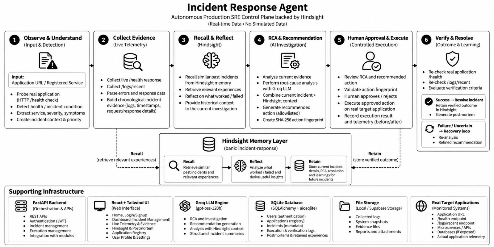

# Hindsight Turns Past Incident Experiences into Actionable Context

**Authors:** Mandapalli Manisha, Doolla Ramya Sri

**GitHub:** https://github.com/Manisha2703/hackthon-agent.git

The most useful thing my incident agent ever remembered was a fix that didn't work.

Most incident runbooks and postmortems concentrate on the successful path: what we changed and how the system recovered. But during an incident, the expensive mistake is often the plausible action that turns out to be wrong. A restart may look reasonable, yet if the real problem is a bad deployment, restarting simply brings the broken version back. The incident eventually gets fixed, but the fact that the restart was a dead end is easy to lose.

I wanted the incident-response system to remember that part.

## What the system does

I built the system as a closed incident-response loop around a set of registered services. An alert enters the system, is converted into structured incident information, and is investigated using both current evidence and relevant past experience.

The flow is:


The important part is the final connection: the incident does not simply disappear when it is resolved. Its experience becomes input to future investigations.

The backend is a FastAPI service with a Streamlit interface for the on-call engineer. The LLM, `openai/gpt-oss-120b` through Groq, handles language-oriented work such as parsing alerts, producing diagnosis text, and selecting from an allowlisted set of remediation actions. It does not directly change infrastructure. State-changing operations go through ordinary Python control flow.

The memory layer is [Hindsight](https://github.com/vectorize-io/hindsight), an open-source [agent memory system](https://vectorize.io/what-is-agent-memory), using a single `incident-response` memory bank. I use its three core operations deliberately: retain experiences, recall relevant experiences, and reflect across those experiences.

## The architecture

I think about the architecture as six practical stages rather than as one large AI pipeline.

**1. Observe and understand.** An incident is opened from an alert, and the system extracts information such as the service, severity, symptoms, errors, impact, and affected components.

**2. Collect evidence.** The agent gathers current health, logs, metrics, service status, and other available telemetry. Root-cause analysis starts from this evidence rather than from memory alone.

**3. Recall and reflect.** Hindsight is queried for similar incidents. Recall provides concrete previous experiences, while reflection asks a more useful question: what worked and what failed in situations like this?

**4. Recommend and approve.** The system proposes one action from a fixed allowlist:

```text
restart\_service
scale\_replicas
set\_config
flush\_cache
rollback\_deployment
```

The recommendation goes to a human before execution. Approval is tied to the exact proposed action rather than merely to the incident.

**5. Execute and verify.** After approval, the action runs and the system checks the actual result using measured telemetry.

**6. Remember.** Successful outcomes and failed attempts are retained. If the action fails, the system re-enters investigation with the failed action excluded from the next proposal. After repeated unsuccessful attempts, the incident escalates with its history attached.

The architecture is intentionally split this way. Language and similarity are where the model and memory layer help; approval, execution, and verification are handled by deterministic application code.

## The through-line: a failed attempt is a memory

The obvious way to use memory is to call `retain` when an incident is resolved. I did that initially. The more interesting problem appeared when I watched a remediation fail.

Consider a bad deployment. A restart is a plausible first response. The service restarts, but the same broken build comes back. Verification catches that failure, the recovery loop excludes the restart, and a later proposal can move toward a rollback.

That solves the problem inside one incident. It does not automatically solve it for the next incident.

If memory only contains the final resolution, a future incident may recall that rollback worked but lose the more useful negative experience: restarting this service after this type of deployment problem did not help.

So the retention step writes failed attempts as separate memory records:

```python
for fa in incident.get("failed\_attempts", \[]):
    action = fa.get("action") or {}
    action\_text = f"{action.get('type')}({action.get('params', {})})"
    service = action.get("target\_service", current\_service)
    reasons = "; ".join(fa.get("reasons", \[])) or "criteria failed"

    items\_to\_retain.append({
        "content": (
            f"Attempted {action\_text} on {service}; "
            f"it did NOT work because {reasons}."
        ),
        "context": f"service: {service}, status: failed\_attempt",
        "metadata": {
            "service": service,
            "status": "failed\_attempt",
            "type": "failed\_remediation"
        }
    })
```

The important detail is that the failure is its own memory, not a footnote buried inside a long successful-resolution record. A retrieval system can then match a future investigation directly against the statement that a particular action failed.

Just as important, the reason for failure comes from the verifier rather than from the language model. The memory records what the system measured, not what the model thinks happened.

## Verification has to be stricter than the model

The verifier uses five explicit criteria after an action:

* **C1:** five health probes, spaced 0.3 seconds apart, all return HTTP 200
* **C2:** error rate is ≤ 1%
* **C3:** p95 latency is ≤ 500 ms
* **C4:** service status is `running`
* **C5:** there are zero `ERROR` log lines since execution started

The result is deliberately three-way rather than simply pass/fail.

If the criteria are satisfied, the result is `SUCCESS`. If telemetry shows no meaningful recovery, it is `FAILURE`. If telemetry improves but the service still does not satisfy the full success criteria, it is `UNCERTAIN`.

```python
elif before\_err > 0 and after\_err >= (0.9 \* before\_err):
    decision = "FAILURE"
    reasons.append(
        f"Error rate showed no meaningful improvement "
        f"({before\_err} -> {after\_err})"
    )
elif before\_err > 0 and after\_err < before\_err:
    decision = "UNCERTAIN"
    reasons.append(
        "Telemetry improved, but the service is not yet fully healthy "
        "and is still below the success threshold."
    )
```

`UNCERTAIN` matters. A partial improvement should not automatically become a remembered fix. It goes back through the recovery path, while the recorded reason preserves the fact that the telemetry did improve.

There is judgment in choosing thresholds such as the 1% error-rate limit and the 0.9 comparison factor. I would not present those numbers as universally correct. They are the project's explicit verification policy, and they need to be calibrated against the services being monitored.

## Approval is tied to the action

Another design decision is that approval is not just a boolean attached to the incident. It is tied to a fingerprint of the exact action, target, and parameters.

```python
def compute\_action\_fingerprint(action\_type, target\_service, params=None):
    params\_json = json.dumps(
        params or {}, sort\_keys=True, separators=(",", ":")
    )
    raw = f"{action\_type.strip()}:{target\_service.strip()}:{params\_json}"
    return hashlib.sha256(raw.encode("utf-8")).hexdigest()
```

When an action is approved, its fingerprint is stored. Before execution, the engine checks that the incident is still approved and that the current action has exactly the same fingerprint.

If the recovery loop proposes a different action, approval returns to `PENDING` and a new approval is required. This prevents an approval for one action from silently authorizing another action later in the incident.

It also keeps the memory trustworthy: the action recorded as failed is the action that was actually approved and executed.

## What it looks like in use

Consider this checkout-service alert:

> `TypeError: Cannot read property 'currency' of undefined at CheckoutOrderService.process on checkout-service v2.4.1 impacting 12% of checkout flows.`

The system extracts the service and symptoms, gathers current evidence, recalls similar experiences, and asks Hindsight to reflect on both successful and failed responses:

```python
query = (
    f"What has worked or failed in past incidents "
    f"similar to: {alert\_text}"
)
response = client.reflect(
    bank\_id=BANK\_ID,
    query=query,
    budget="low"
)
```

That wording is intentional. Asking what *worked or failed* makes negative remediation history part of the reasoning input.

Suppose the first proposal is `restart\_service`. A human approves it, the action executes, and verification shows that the error rate remains essentially unchanged because the same broken build has returned. The result is `FAILURE`, with the measured reason attached to the failed attempt.

The incident moves into its recovery cycle. The approval is reset, the failed restart is passed back into the planner as something not to repeat, and the next proposal becomes `rollback\_deployment`. After a second approval and execution, the five verification criteria pass.

The final outcome contains the successful rollback and the failed restart. Both are retained.

The next time a similar deployment-related incident occurs, recall and reflection can surface both experiences. I am not claiming a measured improvement in incident-resolution accuracy; I have not run an evaluation that would justify such a number. The concrete change is simpler: the failed restart is now retrievable evidence instead of knowledge that existed only in someone's memory.

## Memory should degrade visibly, not silently

Hindsight is useful, but the incident loop should not become unusable just because the memory service is temporarily unavailable.

The system uses a short timeout for Hindsight and falls back to a local keyword-overlap search over retained records if recall fails. The response exposes `memory\_source: "local\_fallback"` so the operator can distinguish a recommendation informed by the memory bank from one produced through the degraded path.

That distinction matters in an incident-response system. A fallback is acceptable; silently pretending that the normal memory path was available is not.

The Hindsight integration also changed how I structure retained information. Instead of trying to write a complete diagnosis and every possible pattern into one large memory, I keep retained experiences small, factual, and specific, then let reflection synthesize patterns across them.

## Lessons learned

**Store negative results as separate, self-contained memories.** A failed remediation buried inside a successful postmortem is much harder to retrieve than an explicit statement that the action did not work.

**Never let the model invent the reason for failure.** The reason should come from measured verification results. Otherwise the system risks building a memory of the model's interpretation rather than the system's observed behavior.

**Give verification a real middle state.** `UNCERTAIN` prevents partial recovery from being stored as a confirmed fix.

**Bind approval to the exact action.** Hashing the action keeps approval, execution, and retained outcome connected to the same artifact.

**Ask memory the question you actually need answered.** "What worked or failed?" is a different retrieval objective from "What happened?" Query design is part of the memory architecture.

## Closing the loop

The rollback that fixes an incident is the obvious thing to write down. The restart that did not work is often more useful to the next engineer.

That became the central design principle of this system: incident memory should not only answer *what fixed this problem?* It should also preserve *what did we try, what failed, and why?*

With [Hindsight](https://hindsight.vectorize.io/), those failed attempts become first-class experiences that can be recalled and reflected on during later incidents. The result is not an agent that magically knows the right answer; it is an incident loop that gets to keep the evidence from its previous mistakes.

